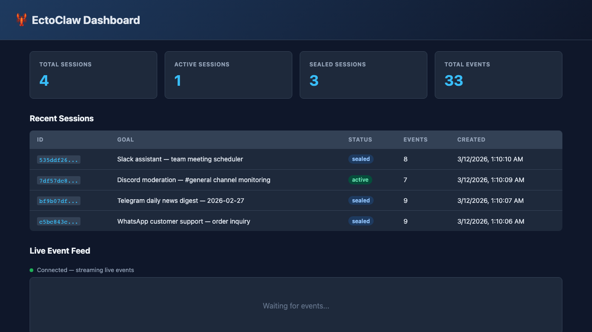
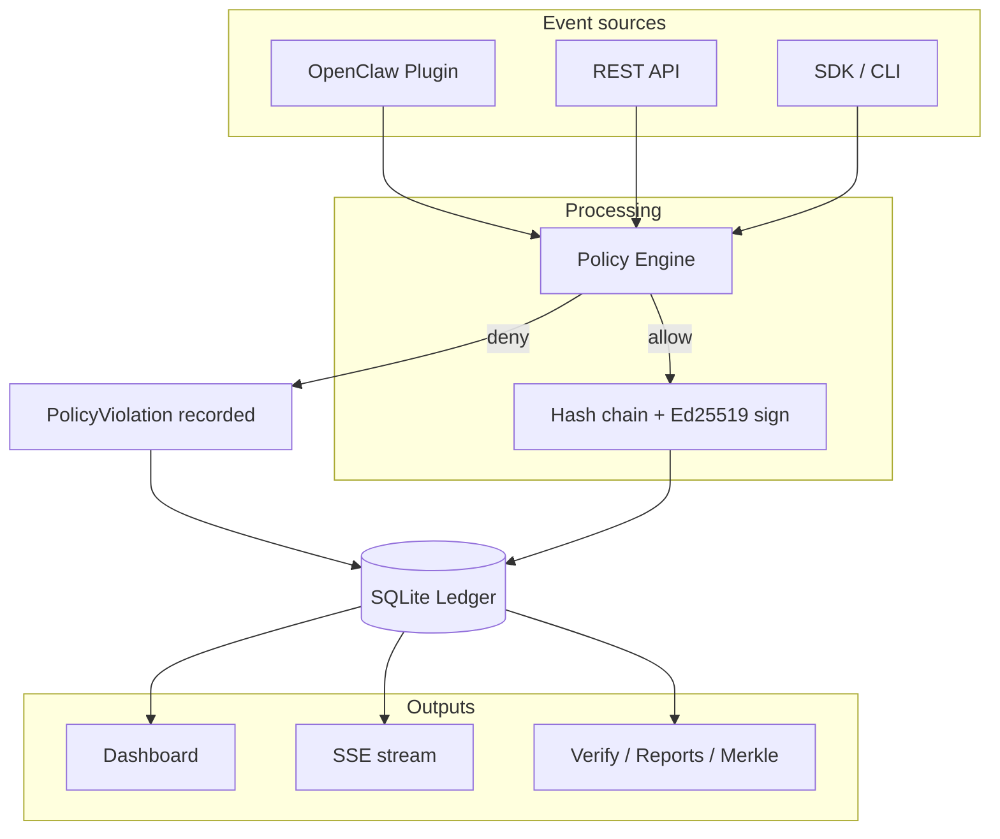

# What is EctoClaw?

<p align="center">
  
</p>

EctoClaw is a fully self-contained AI firewall and cryptographic ledger built to protect your system from rogue OpenClaw agents taking unauthorized or destructive actions.

It is designed to give everyday OpenClaw users, developers, and security teams local, verifiable auditability without the need to deploy a separate enterprise server stack. EctoClaw natively reimplements the core cryptography of EctoLedger in a lightweight package perfectly tailored for agent workflows.

It is much more than a message recorder. EctoClaw acts as a complete ecosystem containing:

- An Immutable Ledger: Records complete agent lifecycles including messages, skills, plugins, tool calls, model requests, and memory operations.
- A Policy Engine: Applies decisions to allow, deny, redact, flag, and set approval gates before and during event processing.
- Cryptographic Evidence: Produces hash chains, Ed25519 signatures, and Merkle tree proofs for compliance and forensics.
- A Unified Product Surface: Ships natively as an Express server, an OpenClaw plugin, a TypeScript SDK, a CLI, and a built-in monitoring dashboard.

### Event flow

Events from OpenClaw, the REST API, or the SDK are evaluated by the policy engine, then hashed and signed before being appended to the immutable ledger. Outputs include the dashboard, SSE stream, and verification/reports.



## Why EctoClaw?

| The Challenge | The EctoClaw Solution |
| --- | --- |
| Agent behavior is hard to audit | Immutable event ledger with per-session verification. |
| Sensitive actions need controls | Policy engine with block, redact, flag, and approval patterns. |
| You need proof of what happened | Compliance bundles, signed event history, and Merkle proofs. |
| You want zero-configuration setup | Works out-of-the-box for OpenClaw users with no complex external dependencies. |
| You need real-time visibility | Built-in dashboard, metrics endpoints, and SSE streaming. |

## Quick Start

### Prerequisites

- Node.js >= 18
- npm

### Install and run locally

```bash
npm install
npm run build
npm test

# start the standalone development server
npm run dev -- serve --dev
```

Server endpoints:

- Dashboard: `http://localhost:3210/dashboard/`
- API: `http://localhost:3210/api/`
- SSE stream: `http://localhost:3210/api/stream`
- Health: `http://localhost:3210/health`

## v0.1.0 Feature Set

### 1) Cryptographic Integrity

- SHA-256 hash chain over event sequences and payloads.
- Ed25519 signature support per event and session.
- Merkle tree generation and proof verification endpoints.

### 2) Policy and Guardrails

- Policy model covering channels, skills, plugins, message filters, approval gates, and step limits.
- Message filters can block, redact, or flag matched content in real-time.
- Policy violations are automatically captured as first-class events on the ledger.

### 3) Event Coverage

EctoClaw natively tracks events across the OpenClaw ecosystem:

- Messaging: `MessageReceived`, `MessageSent`, `ChannelEvent`
- Skills: `SkillInvoked`, `SkillResult`
- Plugins: `PluginAction`, `PluginResult`
- Tools: `ToolCall`, `ToolResult`
- Memory: `MemoryStore`, `MemoryRecall`
- Models: `ModelRequest`, `ModelResponse`
- Compliance: `ApprovalRequired`, `ApprovalDecision`, `PolicyViolation`, `SessionSeal`, `KeyRotation`

### 4) Product Surface

- REST API for sessions, events, policies, verification, reports, metrics, and proof checks.
- OpenClaw plugin package (`src/openclaw/plugin.ts`) for automatic lifecycle capture.
- OpenClaw skill (`skills/SKILL.md`) for natural language querying.
- TypeScript SDK (`ectoclaw/sdk`) for application integration.
- CLI for operations (`serve`, `status`, `sessions`, `verify`, `report`).

## Demo Install and Run

EctoClaw includes demo scripts that generate realistic OpenClaw sessions and live dashboard data so you can see the ledger in action immediately.

### Cross-platform demo (recommended)

Works on macOS, Linux, and Windows.

```bash
npx tsx scripts/demo.ts
```

(Or use `npm run demo`)

### Bash demo (macOS / Linux)

```bash
bash scripts/demo.sh
```

### Optional demo environment variables

```bash
PORT=3210 KEEP_DB=1 npm run demo
```

- `PORT`: override default server port.
- `KEEP_DB=1`: keep the temporary demo database after the script exits for inspection.

## API and CLI

### API groups

- **Sessions:** `GET/POST /api/sessions`, `GET /api/sessions/:id`, `POST /api/sessions/:id/seal` — create, list, inspect, seal.
- **Events:** `GET /api/events?session_id=`, `POST /api/sessions/:id/events` — append and query by session.
- **Verification:** `GET /api/sessions/:id/verify` — verify session hash chain.
- **Compliance:** `GET /api/sessions/:id/compliance` — Merkle compliance bundle for a session.
- **Merkle proofs:** `GET /api/sessions/:id/merkle` (optional `?leaf=` for proof), `POST /api/merkle/verify` — tree root, proof generation, and proof verification.
- **Policies:** `GET /api/policies`, `GET /api/policies/:name`, `PUT /api/policies/:name`, `DELETE /api/policies/:name` — list, get, save, delete.
- **Reports:** `GET /api/reports/:id?format=json|html` — audit reports and compliance data.
- **Metrics:** `GET /api/metrics` — operations and security telemetry.
- **SSE:** `GET /api/stream` — real-time event stream.

### CLI commands

```bash
npx ectoclaw serve --dev
npx ectoclaw status
npx ectoclaw sessions
npx ectoclaw verify <SESSION_ID>
npx ectoclaw report <SESSION_ID> --format html --output report.html
```

## Package Exports

- `ectoclaw`: server and core exports.
- `ectoclaw/sdk`: TypeScript SDK client.
- `ectoclaw/plugin`: OpenClaw plugin integration.

## License

Apache-2.0
